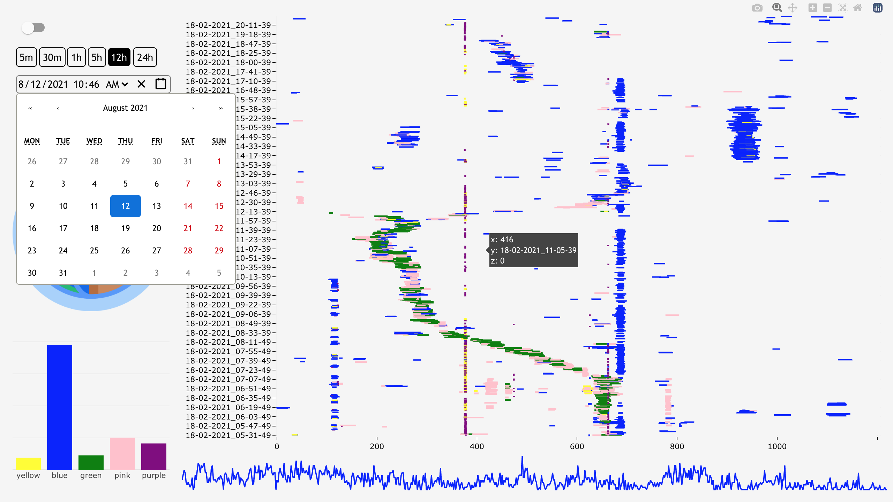

# HeatMapMonitor



```bash
# Run client
cd client 
npm install
npm start

# Build client
cd client 
npm run build

# Run server
pip install {dependencies}
python main.py

# Docker mongo
docker run -d --name mongo -p 27017:27017 mongo:4.1.1
```
